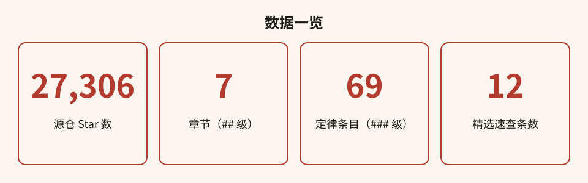
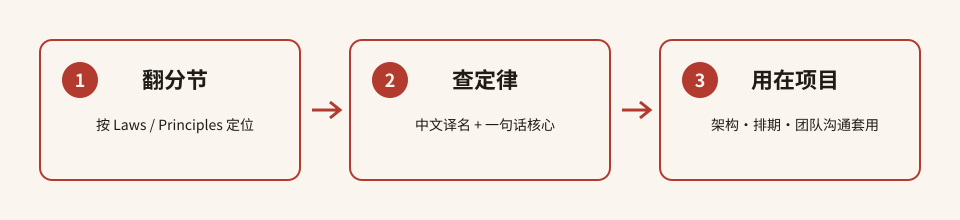

# 开发者定律大全 · 中文版

**27,000+ Star 的开发者智慧，一次读懂软件世界里那些"逃不掉"的规律。**

---

## 目录

- [这是什么](#这是什么)
- [为什么值得收藏](#为什么值得收藏)
- [数据一览](#数据一览)
- [快速开始](#快速开始)
- [分类清单](#分类清单)
- [精选速查表](#精选速查表)
- [全量索引说明](#全量索引说明)
- [FAQ](#faq)
- [参与贡献](#参与贡献)
- [致谢](#致谢)
- [许可声明](#许可声明)

---

## 这是什么

这是一份**软件开发者与技术人必读的定律、原理、模式与理论合集**的中文导读与全量索引。

它回答的，都是你我在工程现场反复碰到的问题：

- 为什么系统越做越复杂、最后谁也不敢动？
- 为什么项目一延期，加人反而更慢？
- 为什么我们的系统架构，总是长得和公司的组织架构一模一样？
- 为什么估出来的工期，永远比实际短一截？
- 为什么某个指标一旦被当成 KPI，它就立刻失效？

源仓库 [dwmkerr/hacker-laws](https://github.com/dwmkerr/hacker-laws) 把这些散落在各处的"行话"整理成了一份带解释的清单，广受开发者欢迎。本仓库**不复制源文正文**，而是提供**中文译名、一句话核心与直达原文的锚点链接**，帮你用最快的速度找到那条"正在坑你"的定律。

## 为什么值得收藏

- **69 条定律/原理/模式/理论**，覆盖架构、排期、团队、UX、分布式、AI 等几乎所有工程话题。
- **中文一句话核心**，不用啃英文长文，30 秒抓住每条定律的要害。
- **直达源文锚点**，每条都能一键跳到原文的详细解释、例子与延伸阅读。
- **真实可考**：星数、分节数、条目数全部来自 2026-10-06 对源仓库的在线实测，不注水。

## 数据一览

## 快速开始

三步走：**① 翻分节**（先判断是"定律"还是"设计原则"）→ **② 查定律**（看中文译名 + 一句话核心）→ **③ 用在项目**（在架构评审、工期估算、团队沟通里直接套用）。

完整的逐条对照见 [**laws-index.md**](./laws-index.md)。

## 分类清单

源 README 共 **7 个 `## ` 章节**，其中 **2 个是收录定律/原理的正文章节**，合计 **69 条 `### ` 条目**；其余 5 个为简介、书单、资源、播客、贡献者等辅助章节。

| 章节 | 中文译名 | 条目数 | 代表定律（节选） |
| --- | --- | --- | --- |
| **Laws** | 定律 | **48** | 墨菲定律 / 阿姆达尔定律 / 布鲁克定律 / 康威定律 / 帕金森定律 |
| **Principles** | 原则 | **21** | 帕累托原则(80/20) / SOLID / KISS / YAGNI / 分布式计算谬误 |
| Introduction | 简介 | 0 | 项目引言与使用提示 |
| Reading List | 阅读书单 | 0 | 《人月神话》《代码整洁之道》《GEB》等 |
| Online Resources | 在线资源 | 0 | CB Insights 等延伸阅读 |
| Podcast | 播客 | 0 | The Changelog 第 403 期 |
| Contributors | 贡献者 | 0 | 全部贡献者名单 |

## 精选速查表

下面 12 条是工程现场最高频、最值得先记住的定律。完整 69 条见 [laws-index.md](./laws-index.md)。

| 定律（中文译名） | 一句话核心 |
| --- | --- |
| **康威定律 Conway's Law** | 系统的架构，会复制组织的沟通结构。 |
| **布鲁克定律 Brooks' Law** | 给延期的项目加人，只会让它更延期。 |
| **墨菲定律 Murphy's Law** | 凡是可能出错的，终将出错——而且挑最糟的时候。 |
| **帕金森定律 Parkinson's Law** | 工作会自动膨胀，填满你给它的所有时间。 |
| **霍夫斯塔特定律 Hofstadter's Law** | 做任何事都比你想的久，哪怕你已经考虑了这条定律。 |
| **阿姆达尔定律 Amdahl's Law** | 并行加速的上限，被那段无法并行的串行部分锁死。 |
| **古德哈特定律 Goodhart's Law** | 当一个度量变成目标，它就不再是好度量。 |
| **KISS 原则** | 保持简单、傻瓜化；多数系统越简单越耐用。 |
| **YAGNI** | 永远只在真正需要时才实现功能，别为"以后"写代码。 |
| **CAP 定理** | 分布式数据系统，一致性、可用性、分区容忍最多同时满足两个。 |
| **漏抽象定律 Leaky Abstractions** | 所有 nontrivial 的抽象，在某种程度上都会"漏水"。 |
| **健壮性原则 Postel's Law** | 对自己要保守，对接受别人的输入要宽容。 |

## 全量索引说明

- 全量 **69 条**条目按章节分组（定律 48 / 原则 21），每条给出：**中文译名 + 英文原名 + 一句话核心 + 源 README 锚点链接**。
- 锚点链接指向源仓库 `dwmkerr/hacker-laws` 的 `main` 分支 README，点击即可跳转到该定律的完整解释、真实案例与延伸阅读。
- 索引文件见 [**laws-index.md**](./laws-index.md)。

## FAQ

**Q：本仓库是完整的中文翻译吗？**
A：不是。本仓库是**中文导读与全量索引**：提供中文译名、一句话核心和直达原文的链接，不收录源文正文。想读完整解释，请点索引里的锚点跳到源 README。

**Q：星数 27,306 是实时的吗？**
A：是 2026-10-06 通过 GitHub API 对源仓库实测的 `stargazers_count`。标题用「27,000+」，badge 用精确值 27,306，后续会随源仓增长。

**Q：为什么许可写的是 CC BY-SA 4.0，不是 MIT？**
A：经 2026-10-06 GitHub API 实测，源仓库 `license.spdx_id` 为 **CC-BY-SA-4.0**（并非 MIT）。本仓库按源许可沿用 CC BY-SA 4.0，详见 [许可声明](#许可声明)。

**Q：69 条是怎么数出来的？**
A：统计方法见 [THIRD_PARTY_NOTICES.md](./THIRD_PARTY_NOTICES.md)。以源 README 正文实际出现的 `### ` 标题为准（而非目录 TOC——TOC 漏列了「The Second-System Effect」等条目）。

## 参与贡献

本索引欢迎补充更贴切的中文译名、校对一句话核心。请先阅读源项目的[贡献指南](https://github.com/dwmkerr/hacker-laws)，并遵守 CC BY-SA 4.0 的署名与相同方式共享要求。

## 致谢

- 由衷感谢 [Dave Kerr (dwmkerr)](https://github.com/dwmkerr) 与 [hacker-laws](https://github.com/dwmkerr/hacker-laws) 的全体贡献者，是他们整理出了这份经典清单。
- 本仓库为社区中文导读，与源项目无隶属关系，仅作学习索引之用。

## 许可声明

- **本仓库**采用 **[CC BY-SA 4.0](./LICENSE)**（知识共享 署名-相同方式共享 4.0 国际许可协议）。
- **源仓库 [dwmkerr/hacker-laws](https://github.com/dwmkerr/hacker-laws)** 同样采用 **CC BY-SA 4.0**（2026-10-06 GitHub API 实测 `license.spdx_id = CC-BY-SA-4.0`；**注意：并非 MIT 许可**）。
- 依据"相同方式共享"条款，本中文索引在源作品基础上整理，亦以 CC BY-SA 4.0 发布；转载时请保留对原作者 Dave Kerr 及贡献者的署名。
